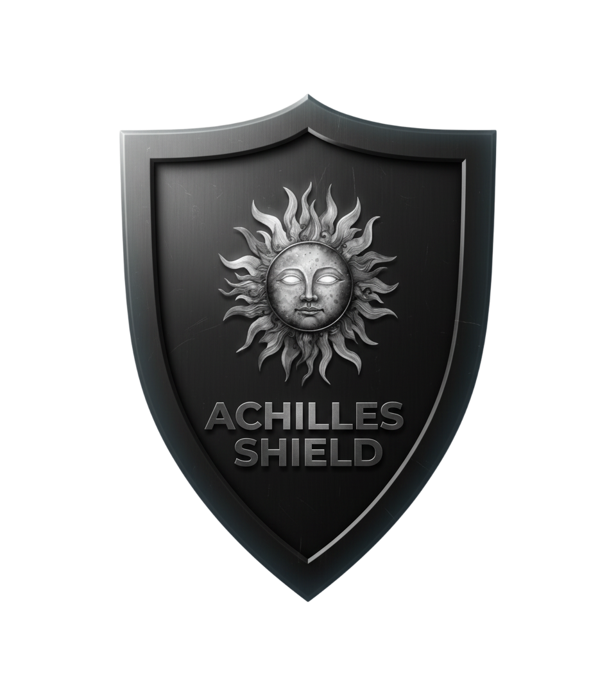

# 🛡️ Achilles Shield

**Achilles Shield** is a next-generation cyber defense framework designed for **governments, enterprises, and critical infrastructure**.  
It provides **server/agent-based monitoring, anomaly detection, and future AI-driven defense capabilities** — all in an easy-to-use, beginner-friendly package.

---



## 🚀 Current Features (Implemented ✅)

### 🔹 Core MVP
- **Agent → Server → Database pipeline**
  - Agents collect telemetry from each host.  
  - Data is securely sent to the server using an API key.  
  - Server stores telemetry in SQLite (`data.db`).  

- **Secure API ingestion**
  - API key authentication between agents and server.  

---

### 🔹 Phase 1 — Richer Data Collection ✅
- Process monitoring (running programs & resource usage).  
- Network connections (open ports, active IPs).  
- Disk usage & storage monitoring.  
- Heartbeat checks (detect if agents go offline).  

---

### 🔹 Phase 2 — Advanced Dashboard ✅
- Real-time graphs (CPU, RAM, disk usage).  
- Alerts & thresholds (CPU > 90%, RAM > 80%, agent offline).  
- Host filtering & per-host dashboards.  
- Clean UI with tables & charts for telemetry data.  

---

## 🔮 Roadmap & Vision

### 🔄 Phase 3 — AI Threat Detection (Next Step)
- **Anomaly Detection (AI/ML)** using scikit-learn (`IsolationForest`, `One-Class SVM`).  
- Detect suspicious spikes, processes, or network activity.  
- Threat logs separate from raw telemetry.  
- Dashboard integration for flagged anomalies.  

### 🔜 Phase 4 — Active Defense
- Server → Agent commands (kill processes, block IPs, isolate machine).  
- Automated playbooks (auto-response to common threats).  
- Integration with Slack/Discord/Teams/email alerts.  
- External threat intelligence feeds.  

---

## ⚙️ Tech Stack

- **Python 3**  
- **Flask** (server + dashboard)  
- **SQLite** (lightweight database)  
- **psutil** (agent telemetry)  
- **Requests** (agent-server communication)    

---

## 📦 Installation & Setup

### 1. Clone the repository
```bash
git clone https://github.com/splasyyy/Achilles-shield.git
cd achilles-shield
```
### 2. Server Setup
```bash
cd server
python -m venv venv
venv\Scripts\activate    # On Windows
pip install -r requirements.txt
set API_KEY=supersecret
python server.py
```

- **Server will run at** http://127.0.0.1:5000

### 3. Agent Setup
```bash
- cd agent
- python -m venv venv
- venv\Scripts\activate    # On Windows
- pip install -r requirements.txt
- set SERVER_URL=http://127.0.0.1:5000/ingest
- set API_KEY=supersecret
- set HOST_ID=my-test-machine
- python agent.py
```

### 🤝 Contributing

- Future contributions are welcome!
- New data collection modules
- AI models for detection
- Dashboard improvements

### 📜 License

MIT License — free for research, learning, and enterprise use.

### 🧠 Author & Visionary

Created by Konstantinos Farris — combining passion for cybersecurity, and AI to build the future of defense tech.
