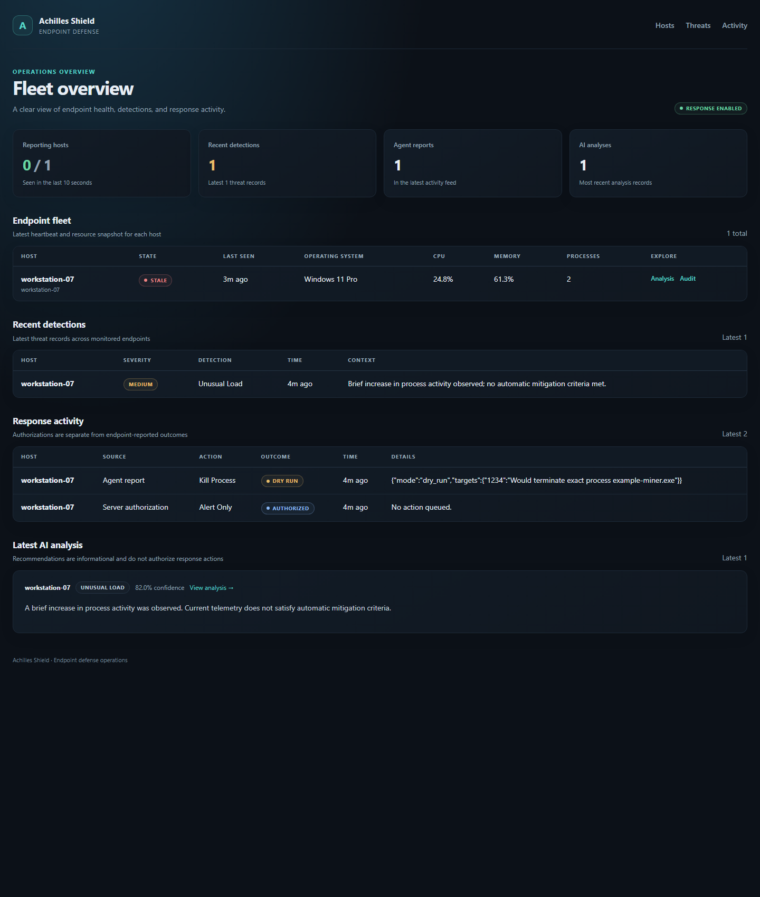

# Achilles Shield

Achilles Shield is a local-first endpoint defense prototype. It collects host
telemetry, analyzes suspicious activity, and provides a dashboard and auditable
response workflow for connected agents.




*Dashboard preview populated with synthetic example data.*

## What it does

- Collects endpoint telemetry and reports it to a Flask server.
- Uses rule-based and anomaly signals to surface activity for investigation.
- Provides a dashboard for host health, detections, analysis, and response history.
- Supports bounded agent-side response actions with server authorization and
  reported outcomes recorded separately for audit.
- Can use a local Ollama model for AI-assisted analysis.

## Response safety

AI recommendations do not authorize destructive actions. Routine process
mitigation is bound to the exact suspicious process identity reported by the
agent and revalidated before termination; protected processes are excluded.
Machine isolation is disabled by default and requires a separate opt-in plus
stronger evidence. Authorization and endpoint-reported results are shown
separately, so an authorization is not proof that an action succeeded.

For an immediate response pause, set `DEFENSE_ENABLED=false` or
`DEFENSE_SAFE_MODE=true` in both the server and agent environments before
starting them. `DEFENSE_DRY_RUN=true` on an agent validates commands without
performing mitigation. See the [quick start](AUTONOMOUS_AI_DEFENSE_QUICKSTART.md)
for controls, defaults, and operational details.

## Get started

Follow the [Autonomous Defense Quick Start](AUTONOMOUS_AI_DEFENSE_QUICKSTART.md)
for prerequisites, server and agent setup, configuration, and troubleshooting.
It documents the optional Ollama/model setup; installing software or downloading
a model are operator-run steps, not actions performed by the repository.

The server listens on `http://127.0.0.1:5000` by default. Set the same
`API_KEY` on the server and agent, and configure the agent's `SERVER_URL` as
the server base URL. A legacy URL ending in `/ingest` is also accepted.
From the `agent` directory, `python agent.py --check` checks local state access
and authenticated server connectivity without sending telemetry or polling
commands.

## Documentation

| Guide | Use it for |
| --- | --- |
| [Autonomous Defense Quick Start](AUTONOMOUS_AI_DEFENSE_QUICKSTART.md) | Current setup, safety controls, configuration, and troubleshooting |
| [Autonomous Defense Explained](AUTONOMOUS_AI_DEFENSE_EXPLAINED.md) | Conceptual background; use the quick start for current behavior and safety policy |

## Development

Run the focused server and response-safety tests from the repository root:

```bash
python -m unittest tests.test_response_safety tests.test_server_flow -q
```

## Project status

This repository is an actively evolving prototype, not a certified or
production-ready endpoint protection product. Validate behavior in an isolated
environment, review the response policy for your deployment, and use dry-run
mode before enabling mitigation on real endpoints.
